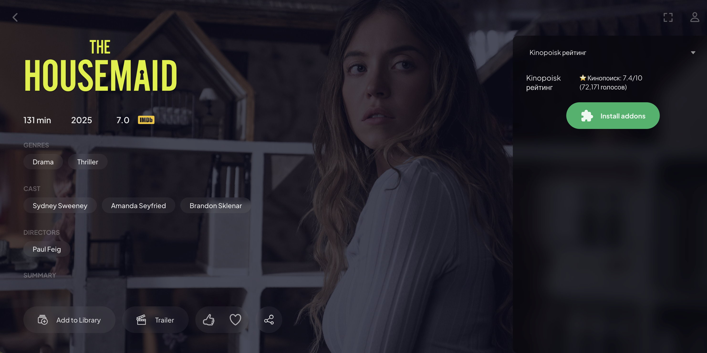

# KinoPoisk Rating Addon для Stremio



Аддон для Stremio, который показывает рейтинг Кинопоиска на странице фильма или сериала.

Аддон работает в режиме страницы тайтла:
- при открытии фильма/сериала делает запрос к KinoPoisk API,
- отображает блок в списке провайдеров стримов (как отдельный источник),
- по клику открывает карточку фильма на Кинопоиске.

## Возможности

- Отображение рейтинга Кинопоиска на странице фильма/сериала.
- Формат вывода:
  - `Kinopoisk рейтинг`
  - `⭐ Кинопоиск: 8.1/10`
  - `(45,123 голосов)`
- Кэширование ответов в памяти.
- Источник данных:
  - [KinoPoisk Unofficial API](https://kinopoiskapiunofficial.tech/)
  - [Документация API](https://kinopoiskapiunofficial.tech/documentation/api/)
- Используемые endpoint'ы:
  - `/api/v2.2/films?imdbId=<tt...>`
  - `/api/v2.2/films?keyword=<title>`
- Учет лимитов API: для `/api/v2.2/films` добавлен троттлинг запросов и пауза после `HTTP 429`.
- Встроенная страница настройки: `/configure` (генерирует персональный manifest URL с параметрами отображения и опциональным API-ключом).

## Требования

- Node.js 18+
- API-ключ KinoPoisk Unofficial (`X-API-KEY`)
- Актуальный источник ключа и API: [kinopoiskapiunofficial.tech](https://kinopoiskapiunofficial.tech/)

## Быстрый старт

```bash
npm install
cp .env.template .env
```

Открой `.env` и укажи ключ в `KINOPOISK_API_KEY`.

## Локальный запуск

```bash
npm start
```

По умолчанию аддон доступен на `http://localhost:3000`.

Страница настройки:
- `http://localhost:3000/configure`

## Деплой на VPS (Traefik + Cloudflare)

Этот раздел для случая, когда у тебя уже есть Traefik на VPS, и ты хочешь поднять аддон на своем поддомене.

Пример домена в инструкции:
- `https://addon.example.com`

### 1. Подготовка сервера

```bash
sudo apt update
sudo apt install -y git curl docker.io
sudo systemctl enable --now docker
```

### 2. Клонирование проекта и установка зависимостей

```bash
sudo mkdir -p /opt
cd /opt
sudo git clone <your-repo-url> kinopoisk-rating-addon
cd /opt/kinopoisk-rating-addon
sudo npm ci --omit=dev
sudo cp deploy/env.production.example .env
```

Отредактируй `/opt/kinopoisk-rating-addon/.env`:
- `KINOPOISK_API_KEY=...`
- `PUBLIC_URL=https://addon.example.com`

### 3. Определение Docker-сети Traefik и cert resolver

```bash
TRAEFIK_NET=$(docker inspect traefik --format '{{range $k, $v := .NetworkSettings.Networks}}{{println $k}}{{end}}' | head -n1)
RESOLVER=$(docker inspect traefik --format '{{range .Config.Cmd}}{{println .}}{{end}}' | sed -nE 's/.*--certificatesresolvers\.([^.]+)\.acme.*/\1/p' | head -n1)
echo "TRAEFIK_NET=$TRAEFIK_NET"
echo "RESOLVER=$RESOLVER"
```

Если одно из значений пустое, нужно вручную указать сеть/резолвер из твоей конфигурации Traefik.

### 4. Запуск контейнера аддона за Traefik

```bash
cd /opt/kinopoisk-rating-addon
TRAEFIK_NET=$(docker inspect traefik --format '{{range $k, $v := .NetworkSettings.Networks}}{{println $k}}{{end}}' | head -n1)
RESOLVER=$(docker inspect traefik --format '{{range .Config.Cmd}}{{println .}}{{end}}' | sed -nE 's/.*--certificatesresolvers\.([^.]+)\.acme.*/\1/p' | head -n1)

docker rm -f kinopoisk-rating 2>/dev/null || true
docker run -d \
  --name kinopoisk-rating \
  --restart unless-stopped \
  --network "$TRAEFIK_NET" \
  --env-file /opt/kinopoisk-rating-addon/.env \
  -e HOST=0.0.0.0 \
  -e PORT=3000 \
  -v /opt/kinopoisk-rating-addon:/app \
  -w /app \
  -l traefik.enable=true \
  -l traefik.docker.network="$TRAEFIK_NET" \
  -l traefik.http.routers.kinopoiskrating.rule='Host(`addon.example.com`)' \
  -l traefik.http.routers.kinopoiskrating.entrypoints=websecure \
  -l traefik.http.routers.kinopoiskrating.tls=true \
  -l traefik.http.routers.kinopoiskrating.tls.certresolver="$RESOLVER" \
  -l traefik.http.services.kinopoiskrating.loadbalancer.server.port=3000 \
  node:20-alpine sh -lc 'npm ci --omit=dev && node src/index.js'
```

### 5. DNS-запись в Cloudflare

В своей зоне Cloudflare:
1. Добавь `A` запись для поддомена:
   - Name: `addon` (или любое другое имя)
   - IPv4: `<your VPS IP>`
   - Proxy status: `Proxied`
2. SSL/TLS режим:
   - `Full (strict)` (если в Traefik настроен ACME/cert resolver).

### 6. Проверка

```bash
curl -sS https://addon.example.com/health
curl -sS https://addon.example.com/manifest.json | head
docker logs -n 100 kinopoisk-rating
```

URL для установки в Stremio:
- `https://addon.example.com/manifest.json`

## Деплой на VPS без Traefik (простой вариант: systemd + Nginx + Cloudflare)

Если у тебя нет Traefik, это самый простой способ:
- запускаем Node.js как systemd-сервис,
- Nginx проксирует запросы на локальный порт аддона,
- Cloudflare дает публичный HTTPS.

Пример домена:
- `https://addon.example.com`

### 1. Подготовка сервера

```bash
sudo apt update
sudo apt install -y git curl nginx
curl -fsSL https://deb.nodesource.com/setup_20.x | sudo -E bash -
sudo apt install -y nodejs
```

### 2. Клонирование проекта и настройка `.env`

```bash
sudo mkdir -p /opt
cd /opt
sudo git clone <your-repo-url> kinopoisk-rating-addon
cd /opt/kinopoisk-rating-addon
sudo npm ci --omit=dev
sudo cp deploy/env.production.example .env
```

Открой `/opt/kinopoisk-rating-addon/.env` и выставь:
- `KINOPOISK_API_KEY=...`
- `PUBLIC_URL=https://addon.example.com`
- `HOST=127.0.0.1`
- `PORT=38117` (или любой другой свободный порт)

### 3. Запуск через systemd

```bash
cd /opt/kinopoisk-rating-addon
sudo chown -R www-data:www-data /opt/kinopoisk-rating-addon
sudo cp deploy/systemd/kinopoisk-rating.service /etc/systemd/system/kinopoisk-rating.service
sudo systemctl daemon-reload
sudo systemctl enable --now kinopoisk-rating
sudo systemctl status kinopoisk-rating --no-pager
```

### 4. Nginx reverse proxy

```bash
sudo tee /etc/nginx/sites-available/kinopoisk-rating.conf > /dev/null <<'EOF'
server {
    listen 80;
    listen [::]:80;
    server_name addon.example.com;

    location / {
        proxy_pass http://127.0.0.1:38117;
        proxy_http_version 1.1;
        proxy_set_header Host $host;
        proxy_set_header X-Real-IP $remote_addr;
        proxy_set_header X-Forwarded-For $proxy_add_x_forwarded_for;
        proxy_set_header X-Forwarded-Proto $scheme;
    }
}
EOF

sudo ln -sf /etc/nginx/sites-available/kinopoisk-rating.conf /etc/nginx/sites-enabled/kinopoisk-rating.conf
sudo rm -f /etc/nginx/sites-enabled/default
sudo nginx -t && sudo systemctl reload nginx
```

Если ты выбрал другой `PORT` в `.env`, обязательно поменяй его в `proxy_pass`.

### 5. DNS в Cloudflare

Для своей зоны Cloudflare:
1. Создай `A` запись:
   - Name: `addon` (или любое имя поддомена)
   - IPv4: `<your VPS IP>`
   - Proxy status: `Proxied`
2. Для быстрого старта установи SSL/TLS mode = `Flexible`.

### 6. Проверка

```bash
curl -sS http://127.0.0.1:38117/health
curl -sS https://addon.example.com/health
curl -sS https://addon.example.com/manifest.json | head
```

Если что-то не работает:
```bash
sudo systemctl status kinopoisk-rating --no-pager
sudo journalctl -u kinopoisk-rating -n 100 --no-pager
sudo nginx -t
```

## Установка в Stremio

1. Открой Stremio.
2. Перейди в `Addons`.
3. Удали старую версию аддона (если установлена).
4. Нажми `Add Addon`.
5. Вставь URL манифеста:
   - `http://localhost:3000/manifest.json` для локального запуска,
   - или публичный URL при деплое.
   - для кастомных настроек открой `/configure`, задай параметры и скопируй сгенерированный URL.
6. На странице фильма/сериала выбери фильтр провайдера `Kinopoisk рейтинг` (или `All`).

## Переменные окружения

| Переменная | По умолчанию | Описание |
|---|---|---|
| `PORT` | `3000` | Порт HTTP-сервера аддона |
| `HOST` | `0.0.0.0` | Хост для bind |
| `PUBLIC_URL` | `http://localhost:<PORT>` | Публичный URL аддона (используется в ссылках) |
| `CINEMETA_BASE_URL` | `https://v3-cinemeta.strem.io` | Апстрим-провайдер метаданных |
| `KINOPOISK_API_KEY` | пусто | API-ключ для `kinopoiskapiunofficial.tech` |
| `CACHE_TTL_MINUTES` | `720` | TTL кэша в памяти |
| `FETCH_TIMEOUT_MS` | `10000` | Таймаут HTTP-запросов |
| `MAX_ENRICH_CONCURRENCY` | `2` | Служебная настройка совместимости |
| `MAX_ENRICH_ITEMS` | `12` | Служебная настройка совместимости |
| `SEARCH_FALLBACK_ENABLED` | `true` | Если `false`, отключает fallback-поиск по названию |
| `MAX_SEARCH_FALLBACK_ITEMS` | `3` | Сколько элементов можно дополнительно проверять через fallback |
| `RATE_LIMIT_COOLDOWN_SECONDS` | `300` | Пауза после `HTTP 429` (если API не вернул Retry-After) |
| `KINOPOISK_MIN_INTERVAL_MS` | `250` | Минимальный интервал между запросами к KinoPoisk |
| `POSTER_OVERLAY_ENABLED` | `false` | Служебная настройка совместимости |
| `TITLE_RATING_ENABLED` | `true` | Служебная настройка совместимости |
| `STREAM_FETCH_CINEMETA_META` | `false` | Если `true`, stream handler дополнительно тянет Cinemeta meta |
| `DEFAULT_STREAM_NAME` | `Kinopoisk рейтинг` | Имя стрима по умолчанию на странице `/configure` |
| `DEFAULT_RATING_FORMAT` | `withMax` | Формат рейтинга по умолчанию: `withMax` или `plain` |
| `DEFAULT_VOTES_FORMAT` | `commas` | Формат голосов по умолчанию: `commas` или `compact` |
| `DEFAULT_DISPLAY_FORMAT` | `multiLine` | Формат строк по умолчанию: `multiLine` или `singleLine` |
| `DEFAULT_SHOW_VOTES` | `true` | Показывать количество голосов по умолчанию |
| `DEFAULT_SHOW_MOVIES` | `true` | Показывать рейтинг для фильмов по умолчанию |
| `DEFAULT_SHOW_SERIES` | `true` | Показывать рейтинг для сериалов по умолчанию |

## Примечания

- Алиас `KINOPOISK_UNOFFICIAL_API_KEY` поддерживается для обратной совместимости.
- Аддон использует фиксированный API-хост `https://kinopoiskapiunofficial.tech` (другой хост/прямой IP без правок кода не поддерживается).
- Из-за отличий в источниках данных поля и сопоставления могут отличаться для отдельных тайтлов.
- Для удаленного доступа (мобильные/TV-клиенты) обязательно указывай корректный `PUBLIC_URL` по HTTPS.
- Для деплоя через Traefik в Docker используй `.env` с `HOST=0.0.0.0` и `PORT=3000`.
- Если у твоего тарифа строгие лимиты API, используй:
  - `SEARCH_FALLBACK_ENABLED=false`
  - `MAX_ENRICH_ITEMS=8`
  - `MAX_ENRICH_CONCURRENCY=2`
  - `KINOPOISK_MIN_INTERVAL_MS=300`
- При `HTTP 402` (квота исчерпана) аддон ставит обогащение рейтингов на паузу до перезапуска или смены ключа.
